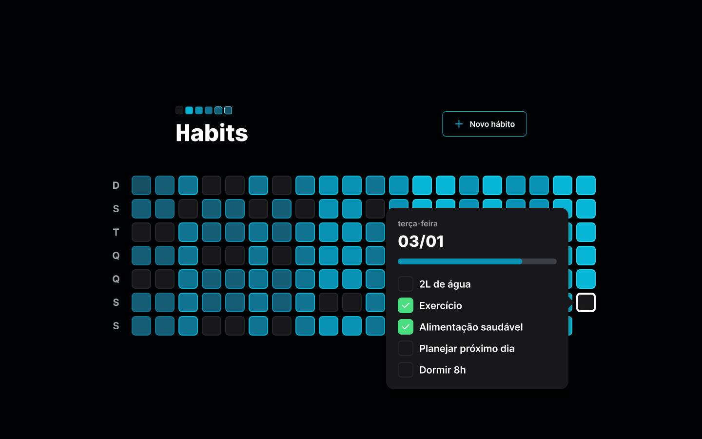
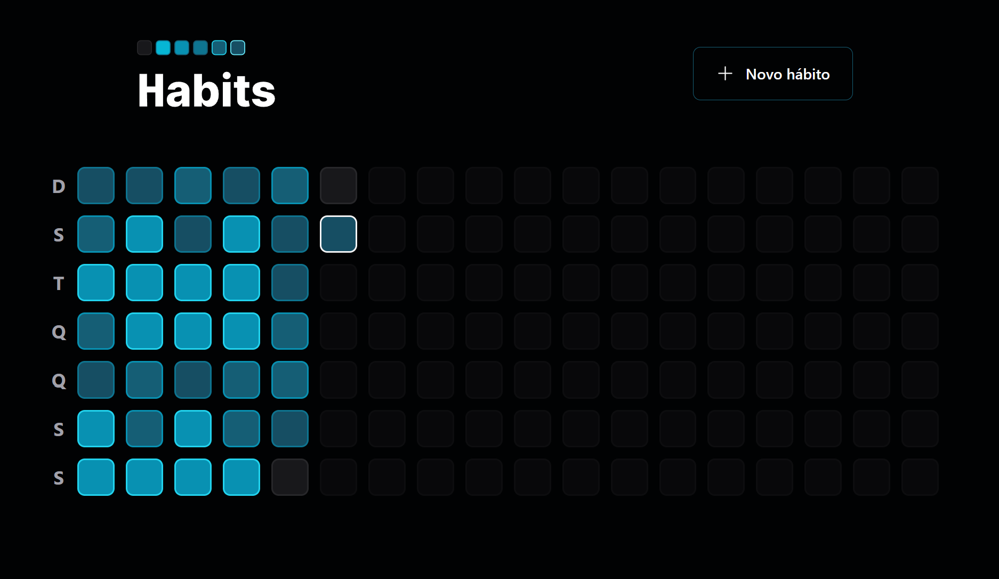
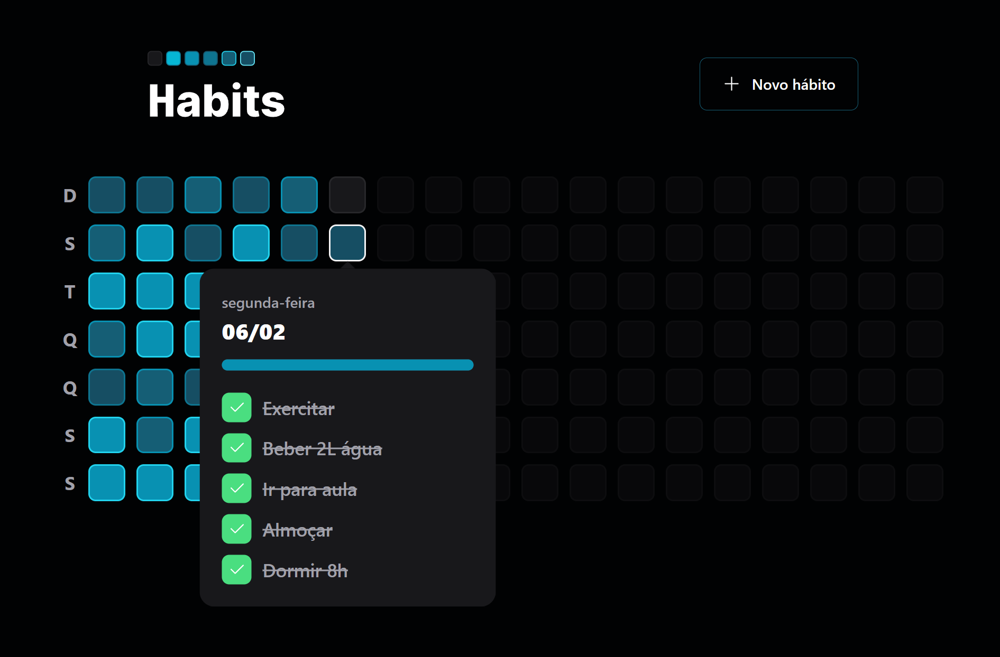
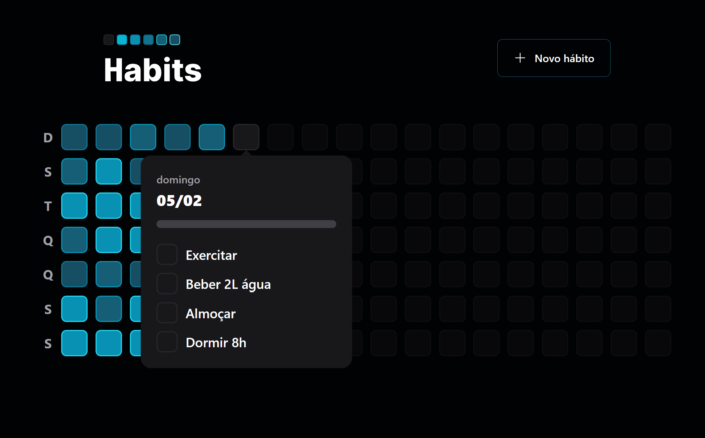
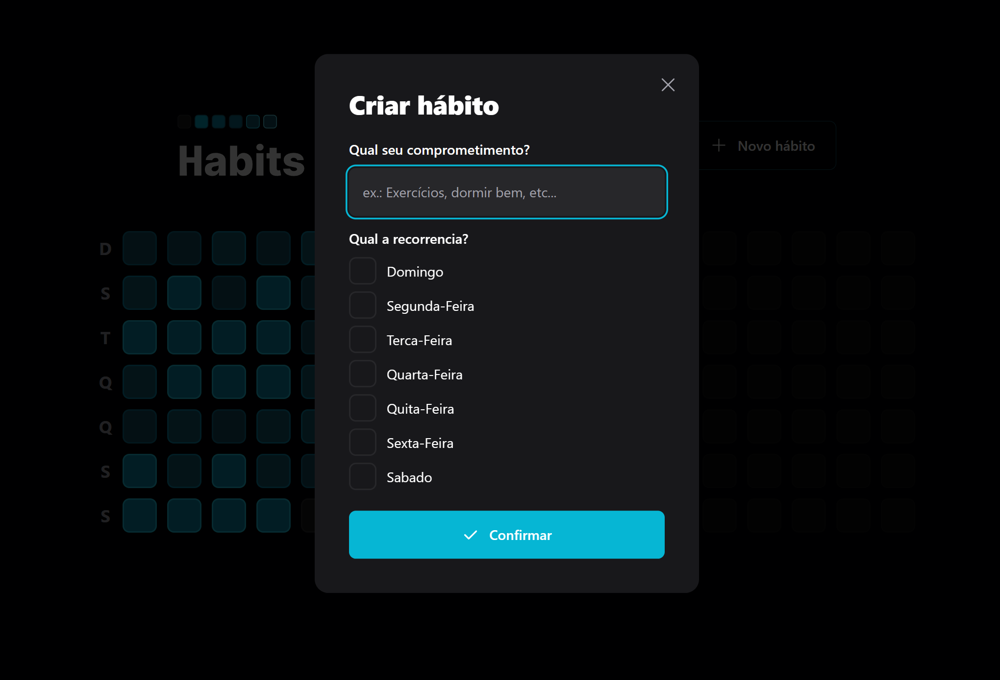
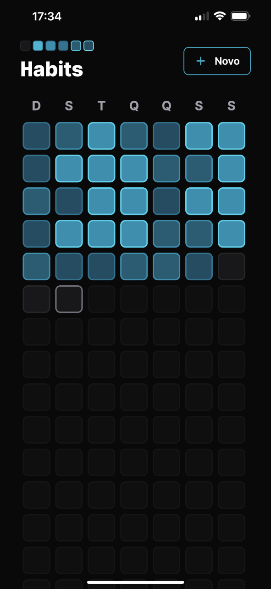
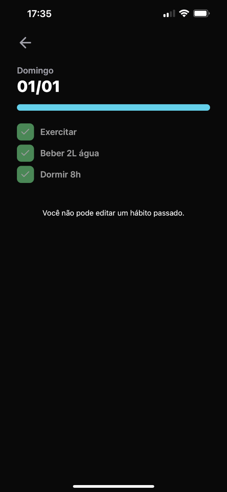
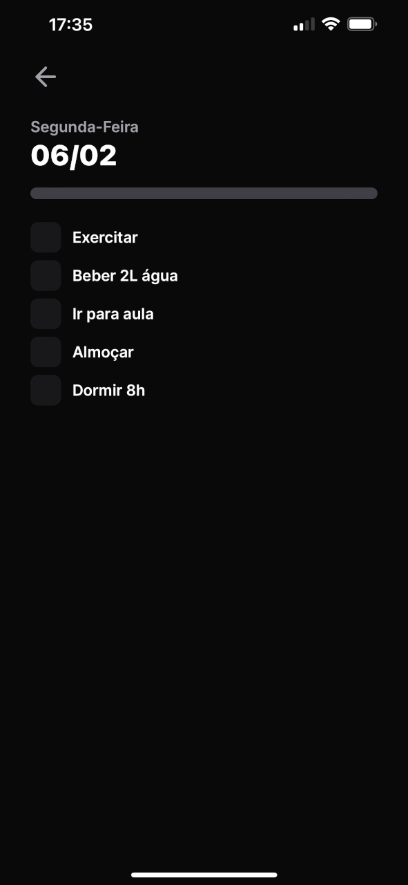
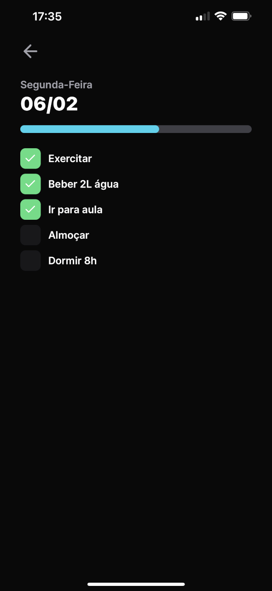
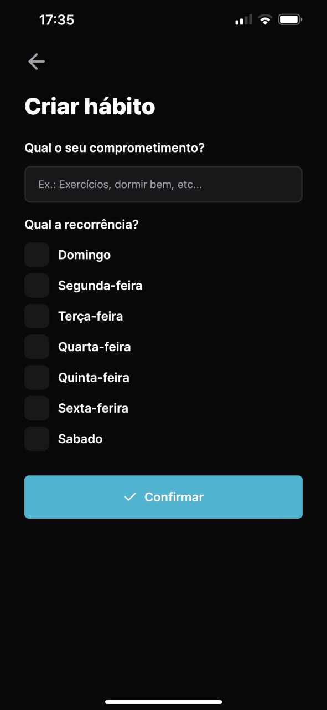

<p align="center">
  <a href="#Sobre App">Sobre App</a> •
  <a href="#Habits">Habits</a> •
  <a href="#Mobile">Mobile</a> •
  <a href="#Princípios">Princípios</a> •
  <a href="#Instalação">Instalação</a>  
</p>

## Sobre App
Projeto criado durante a NLW Setup, uma iniciativa da Rocketseat, 100% online e sem custo, com conteúdo exclusivo e inovador.

O evento foi realizado entre 16 e 20 de janeiro de 2023 e tinha como objetivo demonstrar, na prática, o potencial da stack NodeJS + ReactJS + React Native e como essas tecnologias podem ajudar a alcançar novos níveis na programação.
  
  

<div align="center">

</div>  
  


## Habits
O Habits é um aplicativo que ajuda os usuários a controlar suas tarefas diárias, monitorando as atividades realizadas e não realizadas.

A aplicação Habits permite que seus usuários monitorem suas tarefas diárias, ajudando-os a acompanhar suas atividades realizadas e não realizadas. O processo é simples: o usuário escolhe os hábitos que deseja monitorar e indica em quais dias da semana eles devem ser realizados. Todos os dias, ele tem uma lista de hábitos de acordo com o dia atual, onde pode marcar o status de cada um. A aplicação então gera um progresso diário, ilustrado na barra de progresso e nas cores dos quadrados que representam os dias. Cores mais escuras indicam maior progresso nos hábitos diários.


Ao acessar a página inicial da aplicação web, o usuário será recebido por um botão para adicionar um novo hábito e quadrados que representam dias passados, o dia atual e dias futuros. Cada dia é identificado por uma cor diferente:

- Cinza significa que nenhum hábito foi concluído.
- Cores mais claras indicam pouco progresso em relação aos hábitos diários.
- Cores mais escuras significam muito progresso em relação aos hábitos diários.
- Cinza com transparência reduzida representa dias futuros e não são clicáveis.
  
  


<div> <div/>
  


<div> <div/>
  


<div> <div/>
  


<div> <div/>
  
## Mobile
A tela inicial da aplicação mobile apresenta os quadrados que representam os dias passados, presente e futuro, com cores baseadas em seus respectivos progressos. Cinza indica que nenhum hábito foi realizado, cores claras indicam pouco progresso e cores escuras indicam muito progresso. Além disso, dias futuros são representados com cinza e opacidade reduzida e não são clicáveis. O usuário também pode adicionar novos hábitos clicando no botão apropriado na tela.  
  

|                           Splash Screen                           |                              Home vazia                               |                       Home com progresso                        |
| :---------------------------------------------------------------: | :-------------------------------------------------------------------: | :-------------------------------------------------------------: |
|  |  |  |
  
  |                           Splash Screen                           |                              Home vazia                               |                       Home com progresso                        |
| :---------------------------------------------------------------: | :-------------------------------------------------------------------: | :-------------------------------------------------------------: |
|  |  |  |

## Princípios
- Princípio da Segregação de Interfaces: As interfaces devem ser segregadas;
- Princípio da Inversão de Dependência: Ao invés de uma classe buscar as dependências de que precisa, o contexto informa a classe das dependências necessárias.
- Princípio Aberto/Fechado: As classes da aplicação devem estar abertas para extensão mas fechadas para modificação;
- Princípio da Substituição de Liskov: Devemos ser capazes de substituir uma classe-pai por uma herança sem que isso afete o funcionamento;
- Princípio da Responsabilidade Única: Cada classe tem uma única responsabilidade;
  
## Instalação
Antes de começar, você vai precisar ter instalado em sua máquina as seguintes ferramentas:
> ⚠ Verifique o IP da sua máquina antes de executar o frontend e mobile e configure-o no arquivo de configuração do Axios na pasta "lib" dos projetos correspondentes.

### Rodando o Back End - server
  ```
npm install
npm run dev
```
### Rodando Front End - Web
```
npm install
npm run dev
```
### Rodando Mobile
```
npm install
npx expo start
```
<br />
